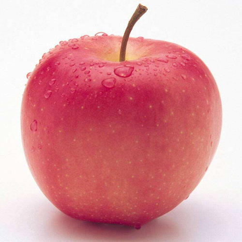

<!DOCTYPE html>
<html>
<head>
    <meta charset="utf-8">
    <meta name="viewport" content="width=device-width,initial-scale=1.0,maximum-scale=1.0,user-scalable=0">
    <title>myProject</title>
    <!-- 引入 js/echarts.min.js -->
    
	
	
		
</head>
<body>
	

<h1>水果分拣系统设计</h1>

 	

	
	

		
<h3>第100个苹果</h3>

		
<h3>体积：中</h3>

		
<h3>成熟度：85%</h3>

	

    

    

	  

    
</body>
</html>
